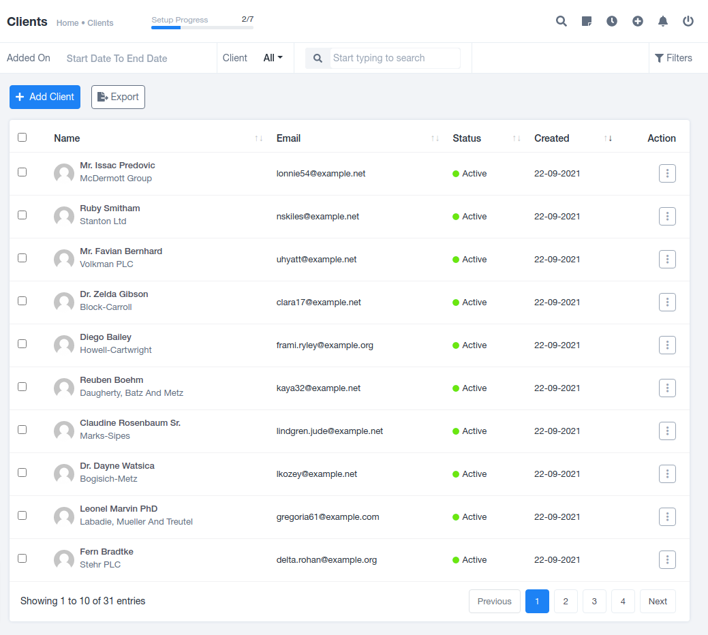

# Clients Module

## Clients Summary

Clients are active customers of the organization listed under this subsection of the Customers module. This section records individual client data, including name, email, status, creation date, and provides options for viewing, editing, and deletion.

### Creating a Client

To add new customers to your organization, follow these steps:

1. Click on the "Add Client" button in blue in the top left corner of the page. Updating and adding new members to the existing list is important.
2. You'll be directed to a pre-generated form. Fill in the following details:
    - **SALUTATION**: Select the addressing salutation (Mr./Mrs./Ms.) for the individual.
    - **CLIENT NAME**: Enter the name of the newly created member.
    - **EMAIL**: Provide the email for communication.
    - **PASSWORD**: Set up a password for account access.
    - **COUNTRY**: Specify the individual's location.
    - **MOBILE**: Include the individual's mobile number for communication.
    - **CAN THE USER LOG IN TO THE APP?**: Select "Yes" or "No" to allow or disallow app access.
    - **CAN THE USER RECEIVE EMAIL NOTIFICATIONS?**: Choose "Yes" or "No" to control email notifications.
    - **CLIENT CATEGORY**: Classify the client into predefined categories for later list filtering.
    - **CLIENT SUB-CATEGORY**: Further categorize the client as needed.
    - **COMPANY NAME**: Provide company details if applicable.
    - **OFFICIAL WEBSITE**: Include the official website link for reference.
    - **GST NUMBER**: Record GST number for payment procedures.
    - **OFFICE PHONE NUMBER**: Collect office phone numbers.
    - **CITY**: Record the city where the organization is based.
    - **STATE**: Document the state where the organization operates.
    - **POSTAL CODE**: Note the postal code for specific location details.
    - **COMPANY ADDRESS**: Collect the complete company address for future reference.
    - **SHIPPING ADDRESS**: Include the address for document or product delivery.

This information is crucial for adding new clients to your organization's customer base.

### Individual Client Details

When you explore individual clients, you'll find several tabs:

1. **PROFILE**: Records comprehensive information about the client, including personal, business, and contact details. It also covers the client's relationship with the organization, projects, invoices, and other financial and legal matters.
2. **PROJECTS**: Records information about officially signed projects between the two parties. An "ADD PROJECT" option allows you to update the list, with an "EXPORT" feature for offline database access.
3. **INVOICES**: Records all created invoices shared with the client for work completed. It also offers a "Creating Invoice" feature and "Export" option for offline data access.
4. **ESTIMATES**: Tracks estimated project costs with negotiation possibilities. This tab records all estimates sent and discussed. You can create a new estimate using the "Create an Estimate" feature, with an "Export" option for offline data access.
5. **CREDIT NOTES**: Stores the amount of invoices that have been paid but canceled, with the amount redeemed in the next invoice. All credit notes for individual clients are kept here.
6. **PAYMENTS**: Records the transaction history for the customer. You can add payments and export the data for offline access.
7. **CONTACTS**: Records contact information for required employees. It allows you to "Add Contacts" and "Export" the list.
8. **NOTES**: Stores key points shared between the two parties. You can "Create/Add New Notes" from the top left corner and "Export" the created notes.
