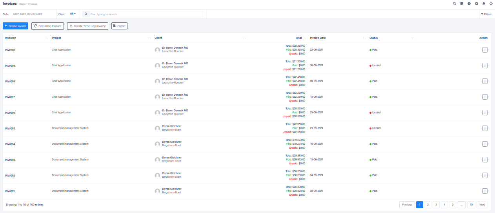
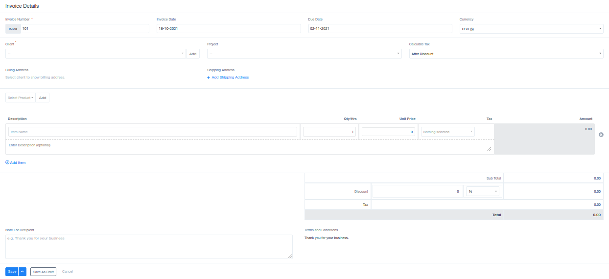
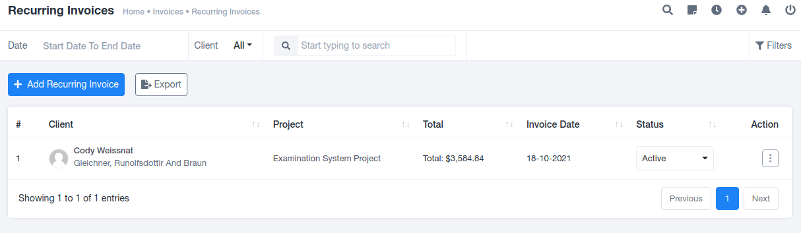
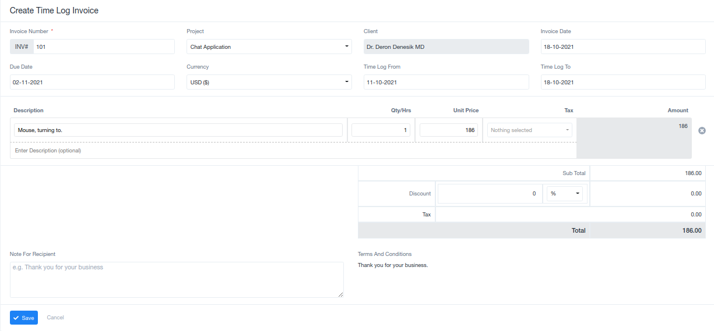
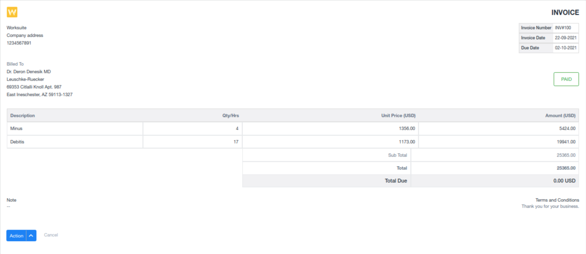

# Invoices

## Overview

An invoice is a formal document issued by a seller to a buyer in a commercial transaction, detailing the products, quantities, and agreed prices for products or services provided by the seller. It also includes payment terms and instructions.

The Invoices section records all created invoices for various projects in a tabular format. This includes essential details like Invoice Number, Project Name, Client Name, Total Project Amount, Invoice Date, Payment Status. In addition, it provides various options such as descriptive view, downloading, sending invoices to clients, editing unpaid invoices, adding payments, generating payment links, sending payment reminders for unpaid invoices, creating credit notes for paid invoices, and deletion of the latest created invoice (please note that any invoice other than the latest one cannot be deleted).

## Options

At the top of the tabular data, you'll find four options, including:

1. **Create Invoice:** This option provides a pre-generated form to fill in the necessary details and create an invoice with ease. It requires information such as invoice number, invoice date, due date, currency, client details, project, taxation details, billing specifics, and a note for the recipient. You can choose to save the invoice as a draft or send it directly to the client.
    
    
    
2. **Recurring Invoice:** This section manages invoices that need to be paid in installments or repeated at specified intervals. It automates invoice generation and sending reminders to clients for scheduled payments. You can add recurring invoices using the "Add Recurring Invoice" option, providing details like invoice date, due date, currency, client details, project details, billing frequency, billing cycle, shipping address, and billing specifics.
    
    
    
3. **Time-Log Invoice:** Time-Log Invoices are created based on the time logged for specific tasks. To create such an invoice, you'll need to provide details like the invoice number, project, client, invoice date, due date, currency, time log details, description, billing specifics, and a note for the recipient.
4. **Export:** The "Export" option allows you to export the list for offline access, making it convenient for record-keeping.
    
    
    

## Viewing and Managing Invoices

If you wish to view a created invoice, simply click on the "INV#xxx" hyperlink, which redirects you to a window displaying complete invoice details. This includes information about both parties, billing details, and additional relevant information. The created invoice can be downloaded as needed or remains securely stored in the system's database, accessible to both parties.

Invoices are vital documents that ensure clarity and transparency in financial transactions. This section streamlines the invoicing process, making it efficient for both your organization and clients.

