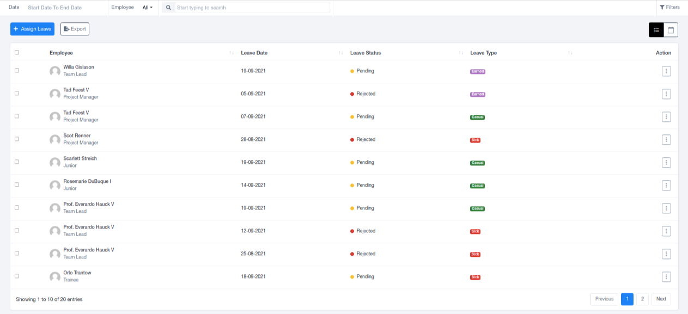

# Leaves

## Leaves

The Leaves section compiles data for leaves taken by all employees within the organization. This data can be viewed in either list or calendar format.

### Leave Records

Leave data includes Employee's name, Leaves Date, Leaves Category, Leaves Status, and additional features for editing and deletion. It also provides a descriptive view (holding the Reason for Absence), approval, and rejection. Admins or individuals with permission can manage approvals and rejections.

### Assigning Leave

You can assign leaves to employees on specific days using the "Assign Leave" option located in the top left corner.

### Leave Categories

While the main three leave categories are casual, sick, and earned, additional categories can be easily added through the Leave Settings section in the Settings Panel.
