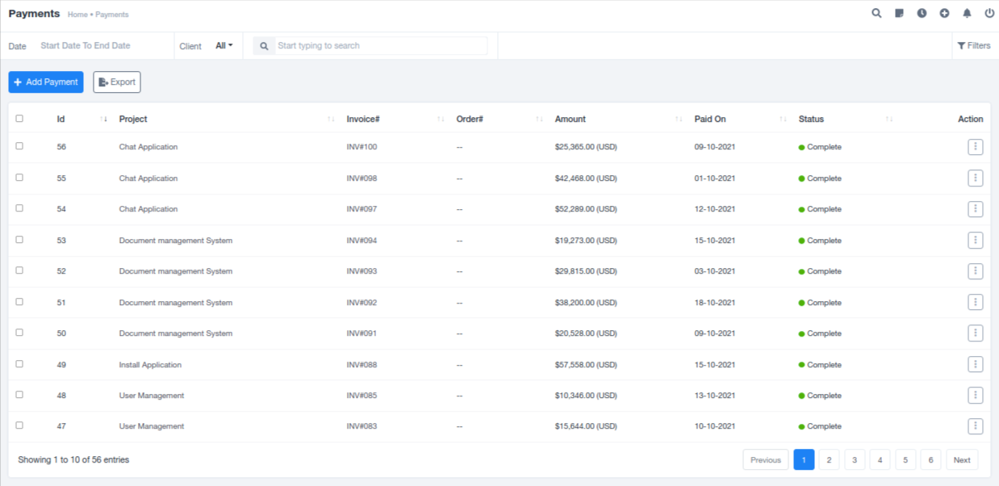
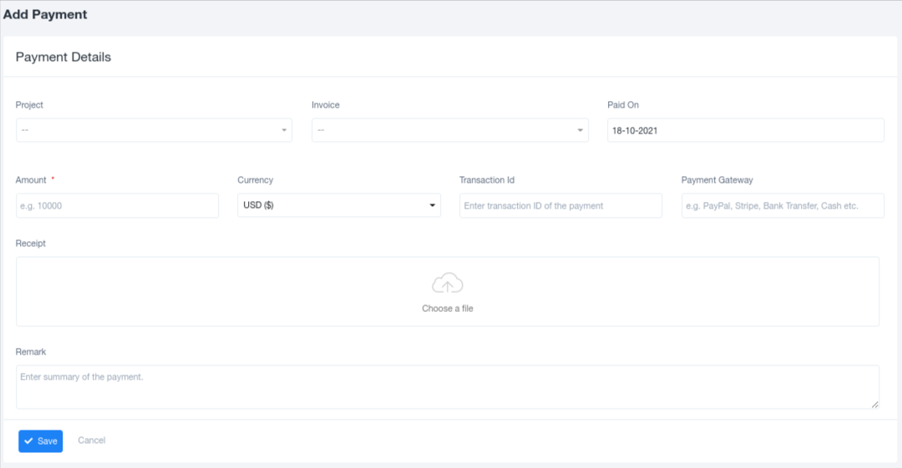
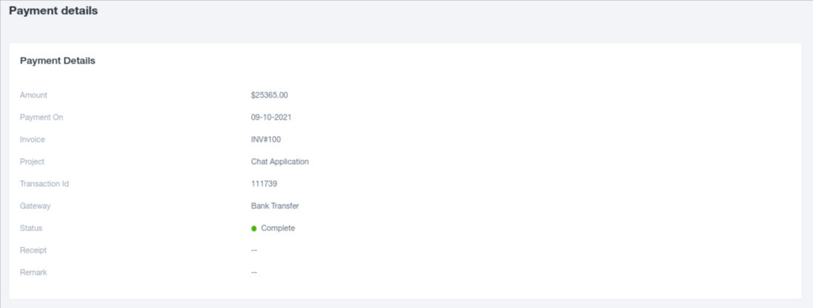

# Payments

## Overview

The Payments section is primarily responsible for recording all the financial transactions made to the organization by clients. It organizes and displays this data in a tabular format for convenient management. The information captured typically includes the relevant project, invoice number, order number, payment amount, payment date, and the payment status. It also offers functionalities for editing, viewing, and deleting payment records. Additionally, the data can be filtered based on project names or payment status for ease of reference.

## Adding Payments

To add payment details, you can use the "Add Payment" option located in the top left corner. This opens a pre-generated form with designated slots for entering the necessary payment information. Once the details are correctly filled in, the data is saved in a tabular format, making it easily accessible for future reference and maintaining an organized financial record.

## Viewing Payment Details

Individual payment details can be viewed by selecting the specific payment record. This detailed view provides information such as payment amount, payment date, associated invoice, project details, transaction ID, payment status, and additional relevant information. To access this view, click the "View" option in the drop-down menu, accessible through the three dots on the right end of the payment record.

