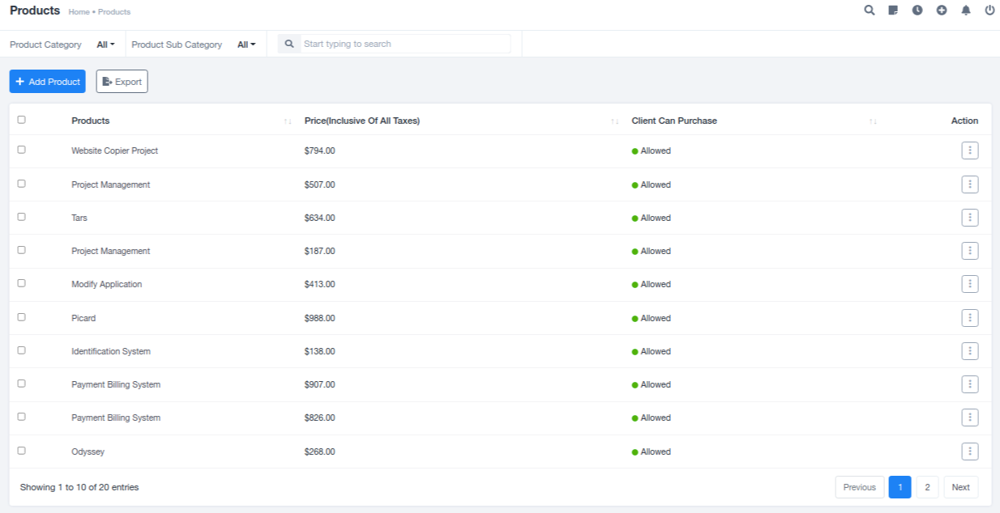
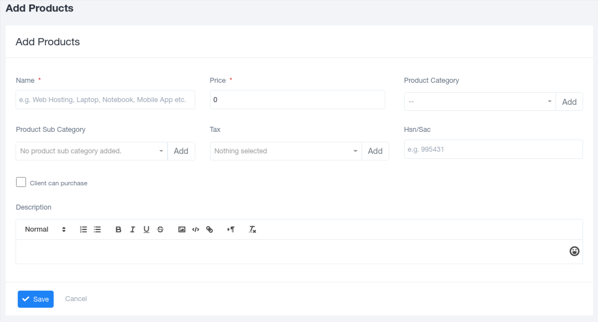
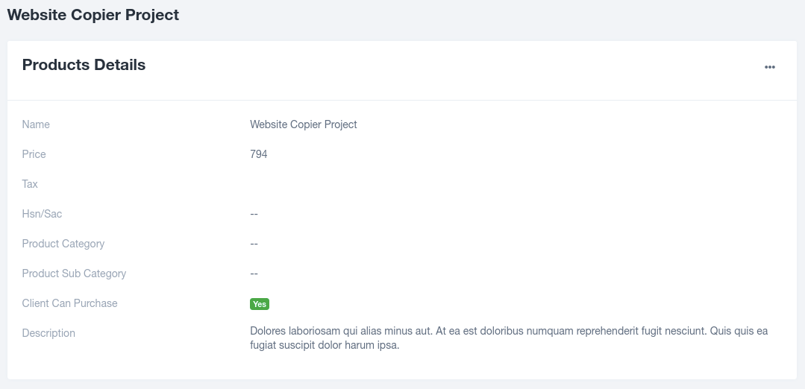

# Products Module

## Overview

The Products section holds a list of generic products or services offered by the company, which can be directly purchased by clients based on their requirements. These services can also be added to specific projects taken up by clients, and an invoice is generated for every product purchase.

### Managing Product List

The list of offered products can be edited as per organizational requirements from the Settings section under the admin account.

### Adding New Products

To add new products to the list, use the "Add Product" option available in the top left corner. In the pre-generated form, fill in the required details. Once all the details are added in the provided slots, save the information, and add the product to the list for client usage.

### Viewing Individual Products

You can view individual products by clicking on their name, which redirects to a detailed product page. This page includes the following details:

- **Name**: The name of the product.
- **Price**: The product's price.
- **Tax**: Tax information.
- **Hsn/Sac**: The HSN (Harmonized System of Nomenclature) or SAC (Services Accounting Code) code.
- **Product Category**: The category to which the product belongs.
- **Product Subcategory**: The subcategory within the product category.
- **Description**: A brief description of the product.
- **Accessibility for the Client**: This accessibility is controlled by the admin, depending on the services provided by the organization.

Reviewing the details of individual products helps clients easily identify their needs before making any specific product purchase.
