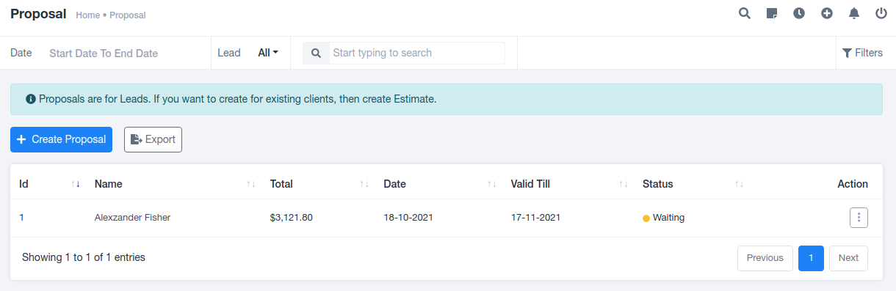
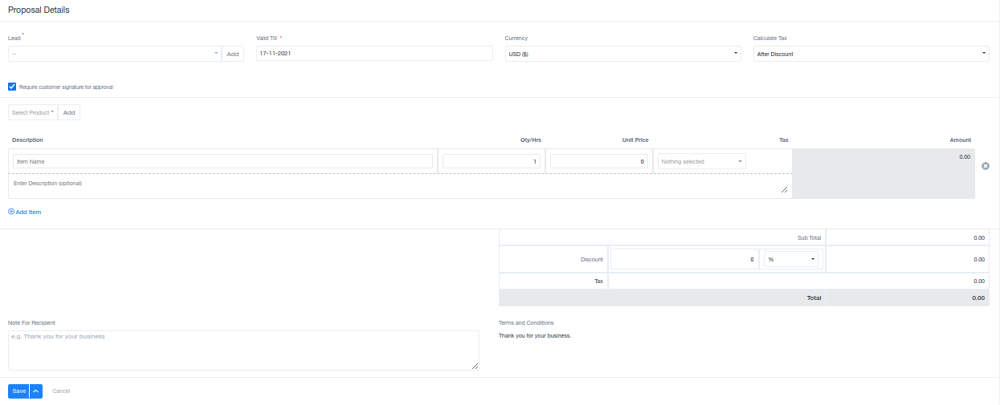
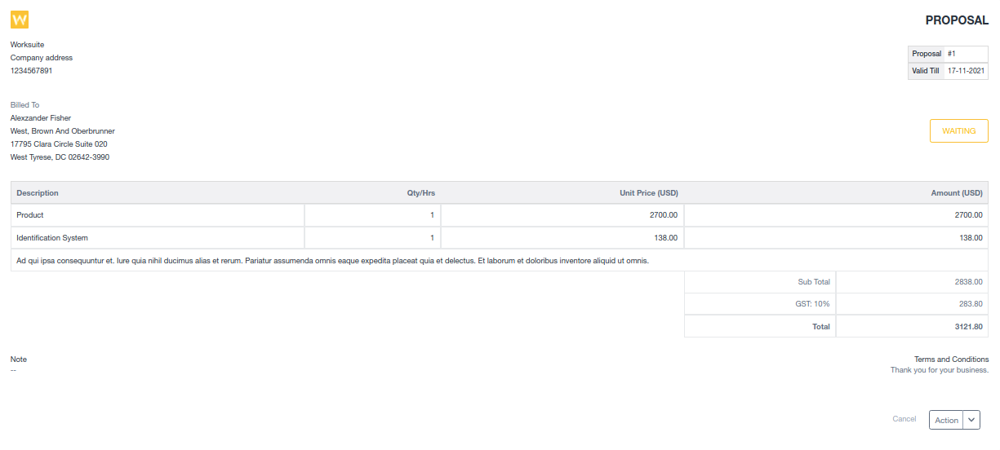

# Proposal

## Overview

The Proposal section is primarily designed for leads. It functions as a repository for proposed budgets and project details submitted by leads. Once a proposal is approved, it can be converted into a contract, and the lead can transition into a client.

## Data Format

Data in this section is organized in a tabular format, displaying the following details:

- Lead's name
- Proposed amount
- Creation date
- Validity date
- Status
- Additional options including editing, deletion, viewing, downloading, sending, and the creation of a public link.

## Creating Proposals

To create a new proposal, use the "Create Proposal" option, located in the top left corner. This involves providing essential details, including:

- Lead's name
- Validity date
- Currency
- Tax calculations
- Product details
- Signature requirements
- Billing information
- A special note for the recipient.

## Viewing Proposals

Once a proposal is created and saved in the system, it can be easily viewed. Individual proposals provide a concise overview of all essential information. This viewable document also offers the option to download it as a PDF file, providing flexibility to users based on their preferences.

## Negotiation

Proposals serve as negotiable documents that facilitate discussions between leads and the organization. They allow both parties to express their requirements and reach a mutually acceptable agreement. The transition from a proposal to a contract signifies the finalization of details and pricing, making it a crucial step in the business process.

Please note that the specific features and capabilities of the Proposal section may vary depending on the software or platform used. The above description offers a general overview of its functionality and features.
