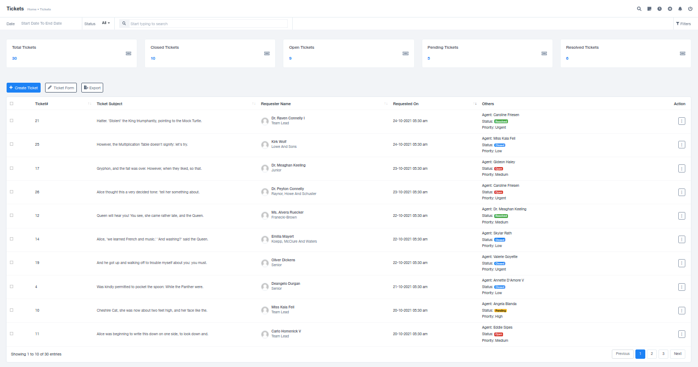
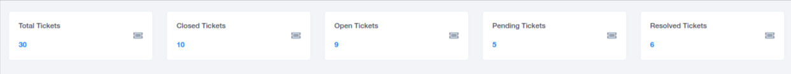
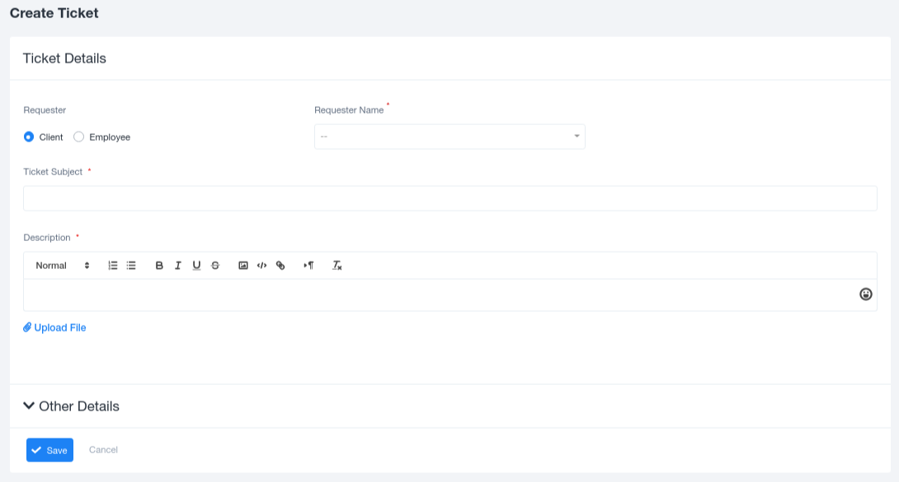
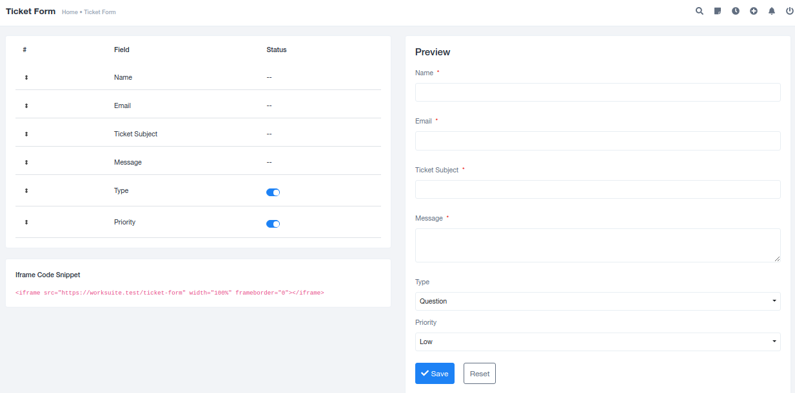

# Tickets

## Overview

Tickets serve as a means to raise problems, queries, incidents, or discussions related to various topics by clients, customers, or employees, which require attention and resolution.

### Overview

The Tickets module consolidates all details related to different issues and discussions in one organized space. The module starts with an overview section that displays statistics regarding the types of tickets handled by the organization. It includes numerical data on various categories:

- Total Tickets: The total number of tickets.
- Closed Tickets: Tickets that have been resolved and closed.
- Open Tickets: Tickets that are currently open and pending resolution.
- Pending Tickets: Tickets that are awaiting action or decision.
- Received Tickets: The total number of tickets received.

Beneath the numerical data, a tabular format displays all the received tickets, with columns for the ticket number, ticket subject, requester name, date of request, and other additional details. Users can conveniently filter and navigate through this list using filter features or tabs that categorize the tickets.

### Creating Tickets

To add a new received ticket to the existing list, a "Create Ticket" form must be filled out. The form includes several fields:

1. **Requester**: A checkbox option to specify whether the ticket is raised by a client or an employee.
2. **Requester Name**: The name of the person raising the ticket.
3. **Ticket Subject**: A brief description of the purpose of raising the ticket.
4. **Description**: Detailed information about the issue or concern, allowing for clear understanding.
5. **Upload File**: Space to attach relevant images, documents, or files for reference.
6. **Agent**: Records the details of the agent assigned to handle the specific ticket.
7. **Priority**: Sets the importance level of the ticket based on the identified issues.
8. **Type**: Categorizes the ticket as a complaint, question, problem, incident, or other relevant types.
9. **Channel Name**: Specifies the source or channel through which the ticket was received, such as Facebook, email, calls, texts, etc.
10. **Tags**: Allows for the addition of tags based on the specific ticket's content.

Once all required details are provided, the data can be saved by clicking on the 'Save' button. This initiates the ticket creation process.

### Customizing Ticket Forms

The "Create Ticket Form" can be customized to suit the organization's specific needs. Fields can be added or removed as required. The ability to customize the form is essential for ensuring that the ticket creation process aligns with the organization's unique requirements.

After making selections or modifications, a preview form is available to review the changes before finalizing the form. This flexibility allows organizations to adapt the ticket creation process to their specific workflow and data collection needs.

The Tickets module plays a vital role in addressing and resolving issues and concerns raised by both employees and clients. By efficiently managing and resolving tickets, organizations can make significant improvements in their operations and customer service.

**Please note that this is a general description of a Tickets module. Specific features may vary based on the software or platform used.**
