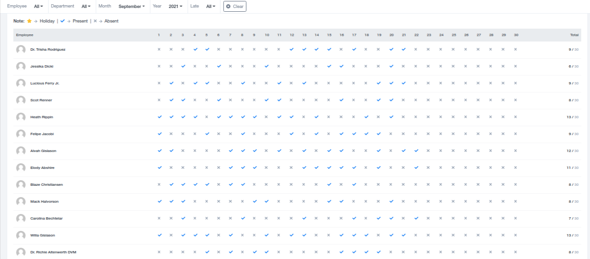

# Attendance

## Attendance

The Attendance Section within the HR Module compiles the entire attendance data for the organization's employees in an easy-to-view format. Users can also choose the member-view format for a more detailed perspective.

### Easy-to-View Format

The easy-to-view format simplifies the process of recording and comprehending attendance data at a glance.

### Member-View Format

The member-view format offers a detailed overview of individual employees' attendance. It includes tracking data for total working days, present days, late days, half days, absent days, and holidays. Users can access this information for each employee individually by selecting their details from the top section.

### Manual Attendance Marking

There is a feature in the top left corner for manual marking of attendance. This allows you to record clock-in and clock-out times, which are visible in the member-view list format as well. This feature enhances flexibility in attendance tracking.
