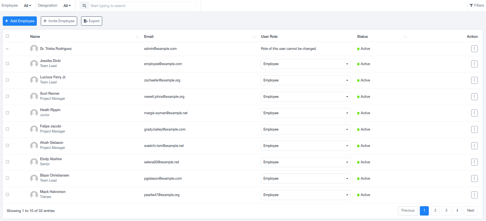

# Employees

## Employees

An employee is an individual who provides services to an organization in exchange for compensation. The Employee section within the HR Module offers a space to record essential data for individuals, which is stored in the organization's database for future reference.

### Employee Records

Employee data is organized in a tabular format, including Name, Email, Role, Status, and a Descriptive View. You can also manage permissions for editing and deletion. To explore an individual's profile in more detail, click on the employee's name.

### Adding Employees

You can add employees manually, inputting all their details, or through an invitation, where they receive a link to complete their profiles. Additionally, there's an option to export the recorded list for offline access.

### Individual Employee Profiles

When you access individual employee profiles, you can dive deeper into their information by section:

1. **PROFILE**: This section provides a comprehensive overview, including personal information, work-related details, assigned tasks, projects, pending work, and other tasks. It simplifies understanding an employee's profile.
2. **PROJECTS**: This sheet records data for all assigned projects, including project names, team members, client names, project status, deadlines, and options for descriptive views, editing, Gantt Chart views, archiving, and deletion. You can add new projects by clicking on "Add Project" in the top left corner and export the list for offline access using the "Export" option.
3. **TASKS**: The Tasks sheet records all tasks for various projects, along with their project details, due dates, statuses, and additional options for editing, descriptive views, and deletion.
4. **LEAVES**: The Leaves sheet records leave applications with statuses (approved/rejected/pending) and leave categories (casual/sick/earned). It provides options for viewing, editing, and deletion. Admins can assign leaves to employees from the top left corner, and the leave list can be exported using the "Export" option.
5. **LEAVE QUOTA**: This section contains statistical data about allotted leaves by category and the leaves taken by individuals in each category.
6. **TIME LOGS**: The Time Logs sheet records the time taken to complete different tasks across sections. It includes details like start and end times, total hours, earnings, and options for editing and deletion. Time logs can be added by clicking on the "Log Time" button in the top left corner, and you can export the list using the "Export" option.
7. **DOCUMENTS**: This sheet collects official documents needed by the organization to maintain accurate records. It simplifies the documentation process by adding details and documents directly to the main database.
8. **PERMISSIONS**: The Permissions sheet allows the admin to specify what can be accessed by each individual. Admin permissions are fixed and cannot be edited.

<aside>
💡 This comprehensive system helps manage and understand employee data efficiently.

</aside>
