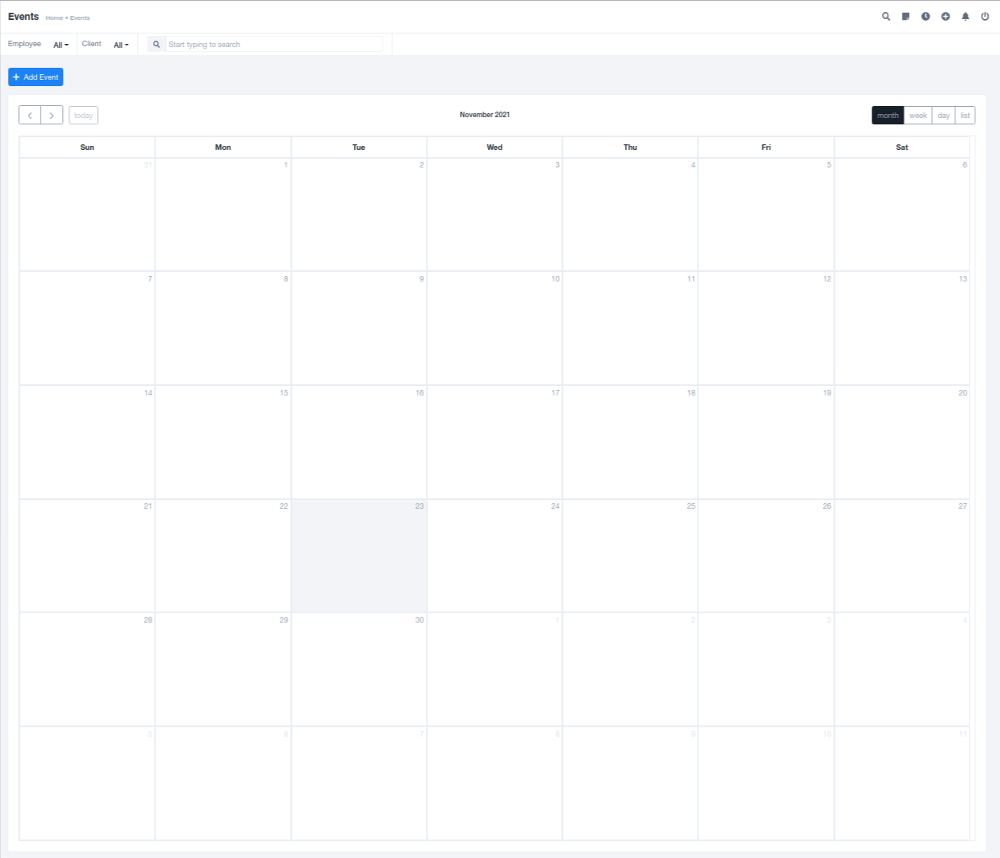
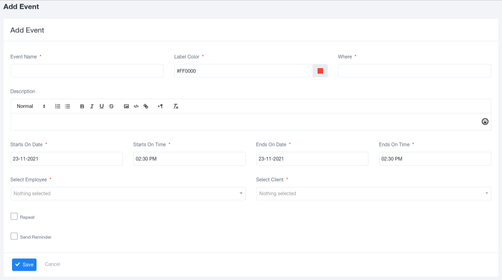

# Events

## Overview

An event is a social occasion organized to mark something unusual or important. The Events module in the software provides a space for recording all significant dates and special occasions that need to be recognized by employees within the organization. This module also serves as a space to schedule meetings and organizational tasks, offering a combined solution for both employees and the organization as a whole.

### Calendar Views

The Events module allows users to view the event list in multiple formats, depending on their preferences. Users can choose from monthly, weekly, or daily views of the calendar. To enhance organization, it's possible to color-code different events with various colors when adding them to the calendar.

### Adding Events

To add new events to the event list, users can utilize the "Add Event" option located in the top left corner. Clicking on this option will open a pre-generated form, where users can input the following details:

1. **Event Name**: A descriptive name for the event to make it easily recognizable.
2. **Label Color**: Assign a specific color code to the event for visual differentiation.
3. **Where**: Specify the location or venue of the event.
4. **Description**: Provide additional details and information about the event that attendees should be aware of.
5. **Start Date and Time**: Indicate the date and time when the event will begin.
6. **End Date and Time**: Specify the date and time when the event will conclude.
7. **Select Employee**: Choose from a list of employees who are invited to attend the event.
8. **Select Client**: Select clients who are invited to participate in the event.
9. **Checkboxes**: Utilize checkboxes for options such as event repetition and setting event reminders based on the event's category or type.

### Importance of Events

Events serve as official spaces to acknowledge important occasions and gatherings that require participation or awareness from all relevant members. They facilitate organization and communication, making it easier for both employees and the organization to stay informed about upcoming events and tasks.
