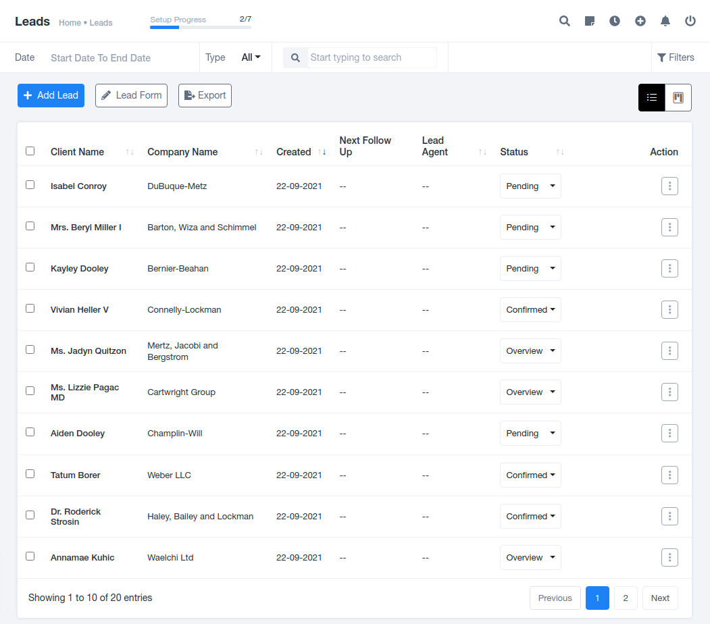

# Leads Module

## **Leads Summary**

Leads are potential customers interested in your organization's products or services. These inquiries are vital for engaging with and converting into satisfied clients.

### **Data Formats**

- **List Format**: Displays lead details including Client's Name, Company's Name, Creation Date, Lead Agent, Scheduled Follow-Up, Status, and offers options for viewing, editing, deleting, or converting leads into clients.
- **Kan-Ban Board Format**: An alternative view for managing leads.

### **Individual Lead Details**

To explore lead details, there are four tabs:

- **PROFILE**: Provides a descriptive overview of an individual's profile.
- **FILES**: Stores project-related files shared between both parties.
- **FOLLOW UP**: Manages scheduled follow-up details.
- **PROPOSALS**: Collects proposals made to leads before they accept one.

These tabs allow you to add files, follow-up details, create proposals, and export the list for offline access.

## **Adding Leads**

To add new leads to your database:

1. Click on the "Add Lead" option in the top left corner of the Leads module.
2. Fill out the following details in the pre-generated form:
    - **SALUTATION**: Select Mr./Mrs./Ms. for addressing the individual.
    - **CLIENT NAME**: Enter the new member's name.
    - **CLIENT EMAIL**: Provide the email for communication.
    - **CHOOSE AGENTS**: Assign organization employees (agents) to interact with the leads.
    - **LEAD SOURCE**: Track the source of maximum engagement for the organization.
    - **LEAD CATEGORY**: Categorize leads based on their queries.
    - **LEAD VALUE**: Estimate the potential charges from the lead if they become a client.
    - **ADD FOLLOW UP**: Indicate if a future conversation with the lead is scheduled.
    - **STATUS**: Define the lead's working status as Pending, Confirmed, or Overview, changeable based on discussions.
    - **NOTE**: Record any important lead requirements for reference.
    - **COMPANY NAME**: Record the organization's name if the lead belongs to a company.
    - **WEBSITE**: Provide the official website link for reference.
    - **MOBILE**: Capture individual contact details for urgent communication.
    - **OFFICE PHONE NUMBER**: Include phone numbers for communication.
    - **COUNTRY**: Specify the country where the organization is located.
    - **STATE**: Record the state where the organization operates.
    - **CITY**: Document the city where the organization is based.
    - **POSTAL CODE**: Note the postal code for detailed location information.
    - **ADDRESS**: Collect the complete company address for future use.

## **Lead Forms**

Customize lead forms to gather only the necessary information for your organization. These forms are visible to individuals when they submit their queries, and fields can be enabled or disabled based on your organization's preferences.

