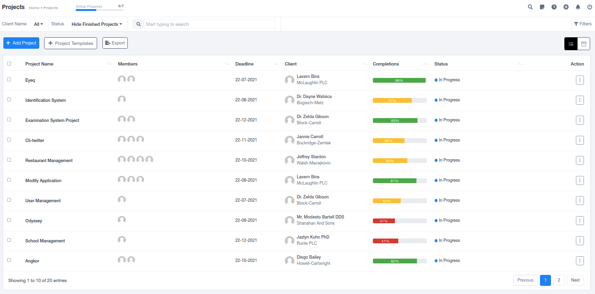
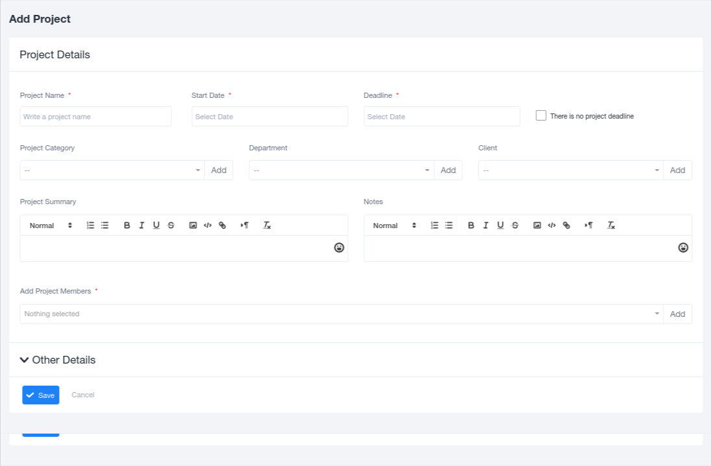
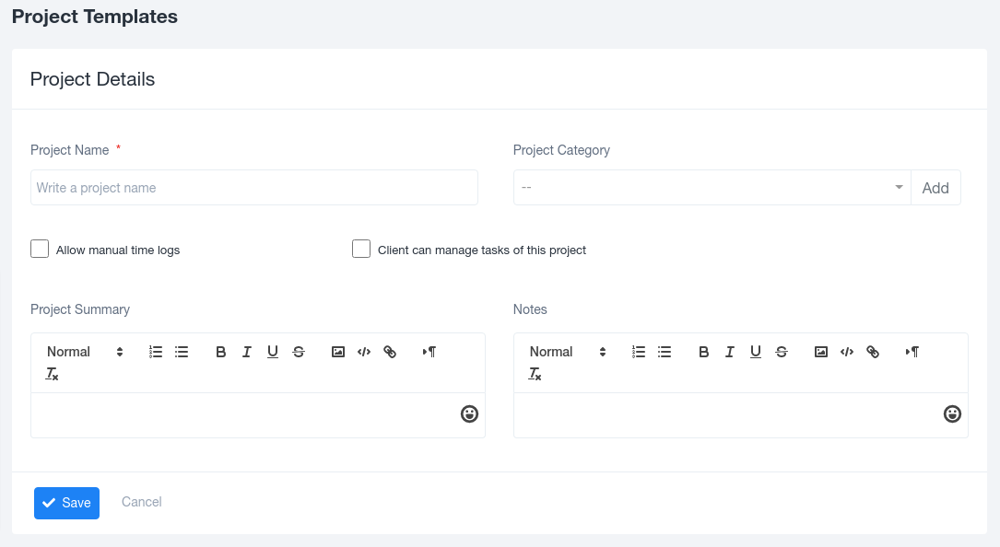

# Projects

## Projects

A project is a carefully planned undertaking, conducted individually or collaboratively, designed to achieve a specific goal.

The Projects section under the Work Module primarily records all projects undertaken by the company for its clients. It includes project details such as team members, deadlines, clients, completion status, and various other options, such as editing, viewing the project as a Gantt Chart, archiving, and project deletion.

### Adding New Projects

Adding new projects is simple. By clicking on the "Add Project" option in the top left corner, a pre-generated form appears on the screen, allowing you to enter project details.

The Add Project form includes fields for Project Name, Start Date, Deadline, Project Category, Department, Client, Project Summary, Notes, Project Members, and any other necessary details.

### Project Templates

Next to the "Add Project" option, there is an option to "Add Project Templates." This feature enables you to quickly create projects by selecting a template, which saves time. The template form requires details like Project Name, Project Category, Project Summary, Notes, and checkboxes to customize the template.

### Viewing Individual Projects

When you click on the name of an individual project in the list, you gain access to various information that can be viewed based on your needs and preferences. Hyperlinks are provided for each of these sections.

1. **Overview**: This section provides a comprehensive overview of the project, including its planning, tasks, and key details, allowing anyone viewing the document to understand the project briefly.
2. **Members**: This section compiles details of all team members and employees working on the project. You can also add new members to the project by clicking on the top left corner.
3. **Files**: This section offers space to store important project-related documents, providing easy access to everyone involved.
4. **Milestones**: This section records milestones achieved in the project, helping track progress.
5. **Tasks**: It tracks tasks created for the project, assisting in logging work and project completion.
6. **TaskBoard**: The Taskboard is a Kanban format for tracking tasks, simplifying the tracking process.
7. **Gantt Chart**: The Gantt Chart provides a visual representation of the project's timeline, showing the period over which tasks are spread.
8. **Invoices**: This section holds all invoices created for the specific project, facilitating financial tracking.
9. **Time Logs**: Space for logging time spent on different project tasks, contributing to recording the total time taken for the entire project.
10. **Expenses**: Records all expenditures related to the project, adding them to the organization's overall expenses.
11. **Payments**: The transaction history for each project is saved here, streamlining financial record-keeping.
12. **Discussion**: Records important discussions among employees or between the client and employees, shaping the project's future progress.
13. **Notes**: A section for storing essential points to remember while working on the project.
14. **Burndown Chart**: A graphical representation of the work remaining versus time, comparing the ideal work structure with the actual work structure.
15. **Rating**: Records client ratings and feedback for the project's work, providing a space for feedback collection.

This comprehensive system makes project management more efficient and transparent.
